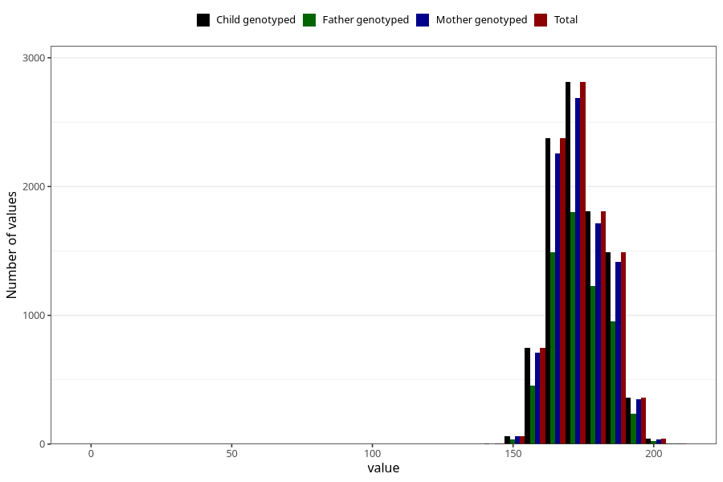

# height_ung
Variable mapping to `UH51` in `UngHelse_standard`.
- Number of values:

| Value | Total | Child genotyped | Mother genotyped | Father genotyped |
| ----- | ----- | --------------- | ---------------- | ---------------- |
| Missing | 71286 | 71286 | 67369 | 47358 |
| Non-missing | 9719 | 9719 | 9248 | 6246 |
| 25th percentile | 167 | 167 | 167 | 167 |
| 50th percentile | 173 | 173 | 173 | 173 |
| 75th percentile | 180 | 180 | 180 | 180 |
| Mean | 173.470007202387 | 173.470007202387 | 173.491565743945 | 173.634486071085 |
| Standard deviation | 10.0754256080485 | 10.0754256080485 | 9.88282896938924 | 10.1285771721635 |
| N | 9719 | 9719 | 9248 | 6246 |

