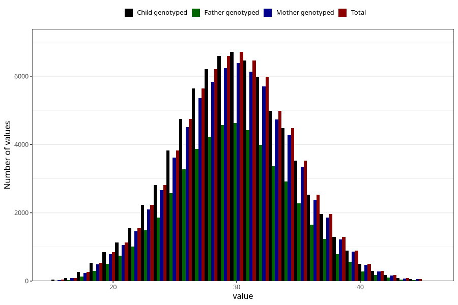

# mother_age_15w
Variable mapping to `MOR_ALDERUTFYLT_S1` in `Skjema1_v12`.
- Number of values:

| Value | Total | Child genotyped | Mother genotyped | Father genotyped |
| ----- | ----- | --------------- | ---------------- | ---------------- |
| Missing | 4514 | 4514 | 4219 | 2522 |
| Non-missing | 76491 | 76491 | 72398 | 51082 |
| 25th percentile | 27 | 27 | 27 | 27 |
| 50th percentile | 30 | 30 | 30 | 30 |
| 75th percentile | 33 | 33 | 33 | 33 |
| Mean | 29.7445843301826 | 29.7445843301826 | 29.7600486201276 | 29.7034571864845 |
| Standard deviation | 4.53916145537768 | 4.53916145537768 | 4.52895396509706 | 4.42373023531332 |
| N | 76491 | 76491 | 72398 | 51082 |

