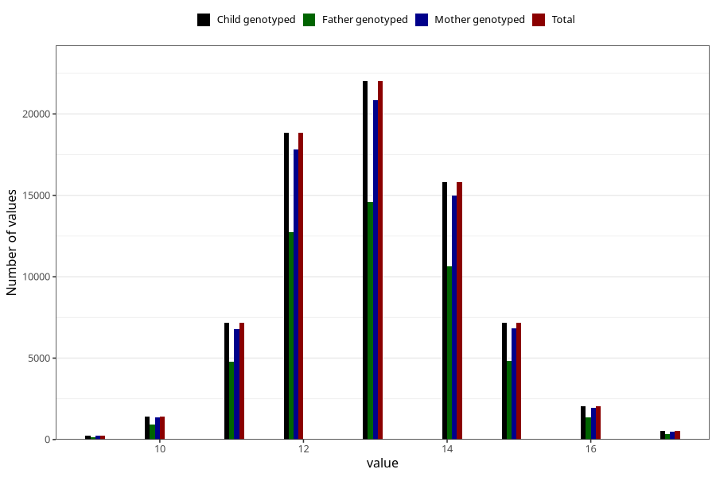

# mother_age_at_menarche
Variable mapping to `AA12` in `Skjema1_v12`.
- Number of values:

| Value | Total | Child genotyped | Mother genotyped | Father genotyped |
| ----- | ----- | --------------- | ---------------- | ---------------- |
| Missing | 5702 | 5702 | 5350 | 3308 |
| Non-missing | 75303 | 75303 | 71267 | 50296 |
| 9 | 228 | 228 | 218 | 150 |
| 10 | 1411 | 1411 | 1338 | 934 |
| 11 | 7189 | 7189 | 6805 | 4758 |
| 12 | 18866 | 18866 | 17803 | 12728 |
| 13 | 22007 | 22007 | 20864 | 14588 |
| 14 | 15822 | 15822 | 14976 | 10618 |
| 15 | 7193 | 7193 | 6811 | 4816 |
| 16 | 2061 | 2061 | 1956 | 1361 |
| 17 | 526 | 526 | 496 | 343 |

