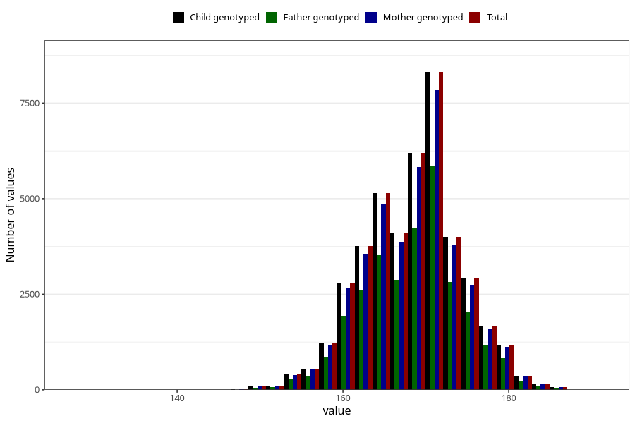

# mother_height_3y
Variable mapping to `GG502` in `Skjema6_3aar_v12`.
- Number of values:

| Value | Total | Child genotyped | Mother genotyped | Father genotyped |
| ----- | ----- | --------------- | ---------------- | ---------------- |
| Missing | 37891 | 37891 | 35839 | 23645 |
| Non-missing | 43114 | 43114 | 40778 | 29959 |
| 25th percentile | 164 | 164 | 164 | 164 |
| 50th percentile | 168 | 168 | 168 | 168 |
| 75th percentile | 172 | 172 | 172 | 172 |
| Mean | 168.350396622907 | 168.350396622907 | 168.346412281132 | 168.376013885644 |
| Standard deviation | 5.85277660977861 | 5.85277660977861 | 5.86790565279032 | 5.8347438146111 |
| N | 43114 | 43114 | 40778 | 29959 |

