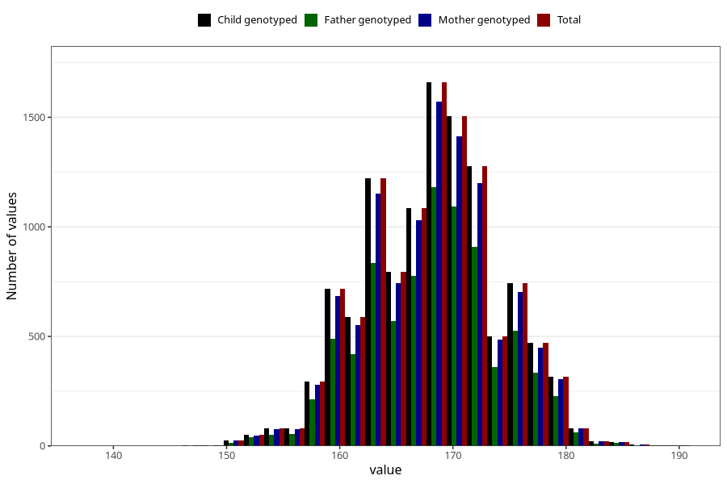

# mother_height_5y
Variable mapping to `LL338` in `Skjema5aar_v12`.
- Number of values:

| Value | Total | Child genotyped | Mother genotyped | Father genotyped |
| ----- | ----- | --------------- | ---------------- | ---------------- |
| Missing | 69459 | 69459 | 65688 | 45411 |
| Non-missing | 11546 | 11546 | 10929 | 8193 |
| 25th percentile | 164 | 164 | 164 | 164 |
| 50th percentile | 168 | 168 | 168 | 168 |
| 75th percentile | 172 | 172 | 172 | 172 |
| Mean | 168.266066170102 | 168.266066170102 | 168.285113002104 | 168.328329061394 |
| Standard deviation | 5.85726457192447 | 5.85726457192447 | 5.87667290195268 | 5.84054050844337 |
| N | 11546 | 11546 | 10929 | 8193 |

