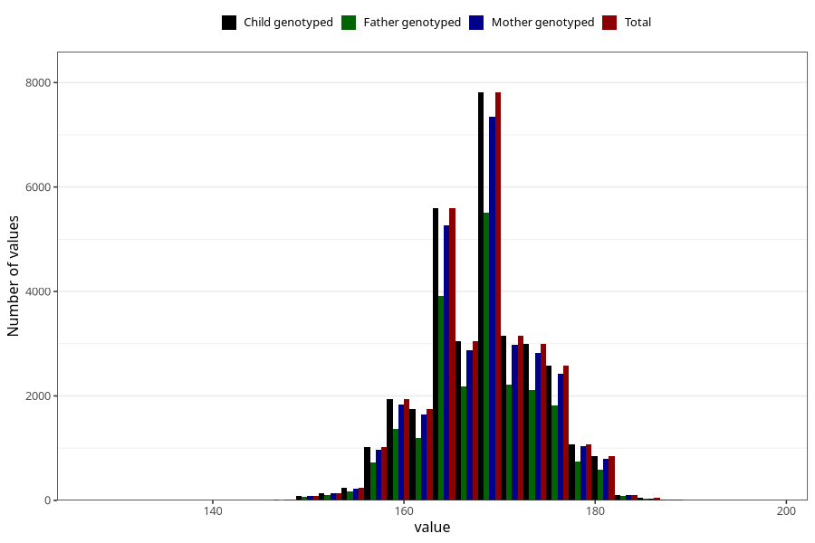

# mother_height_8y
Variable mapping to `NN283` in `Skjema8aar_v12`.
- Number of values:

| Value | Total | Child genotyped | Mother genotyped | Father genotyped |
| ----- | ----- | --------------- | ---------------- | ---------------- |
| Missing | 48581 | 48581 | 46009 | 30776 |
| Non-missing | 32424 | 32424 | 30608 | 22828 |
| 25th percentile | 164 | 164 | 164 | 164 |
| 50th percentile | 168 | 168 | 168 | 168 |
| 75th percentile | 172 | 172 | 172 | 172 |
| Mean | 168.282260054281 | 168.282260054281 | 168.284206743335 | 168.287278780445 |
| Standard deviation | 5.86236244734139 | 5.86236244734139 | 5.87307257959004 | 5.85278887280259 |
| N | 32424 | 32424 | 30608 | 22828 |

