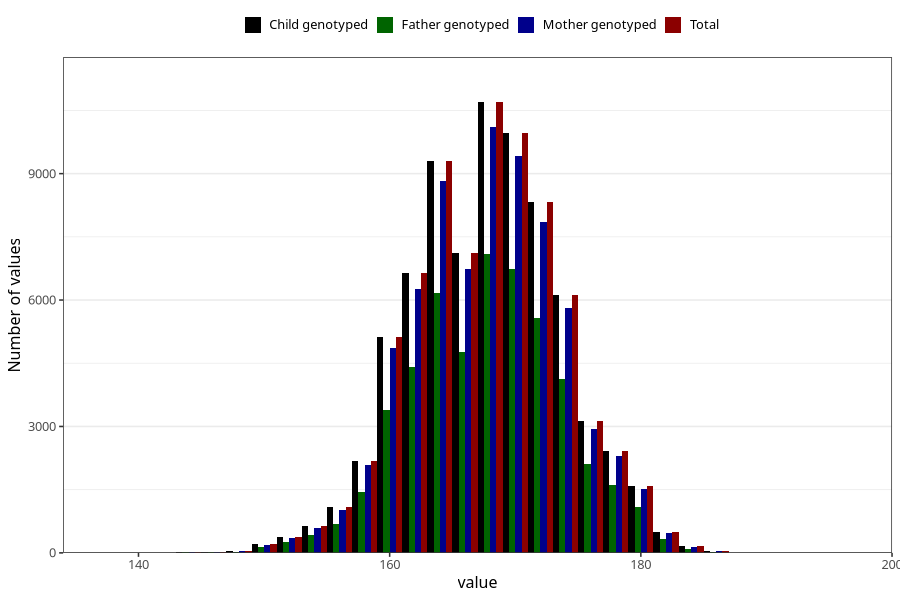

# mother_height_self
Variable mapping to `AA87` in `Skjema1_v12`.
- Number of values:

| Value | Total | Child genotyped | Mother genotyped | Father genotyped |
| ----- | ----- | --------------- | ---------------- | ---------------- |
| Missing | 5360 | 5360 | 5023 | 3056 |
| Non-missing | 75645 | 75645 | 71594 | 50548 |
| 25th percentile | 164 | 164 | 164 | 164 |
| 50th percentile | 168 | 168 | 168 | 168 |
| 75th percentile | 172 | 172 | 172 | 172 |
| Mean | 168.183025976601 | 168.183025976601 | 168.184778054027 | 168.22453905199 |
| Standard deviation | 5.88971920452075 | 5.88971920452075 | 5.89406214660452 | 5.87848791868281 |
| N | 75645 | 75645 | 71594 | 50548 |

