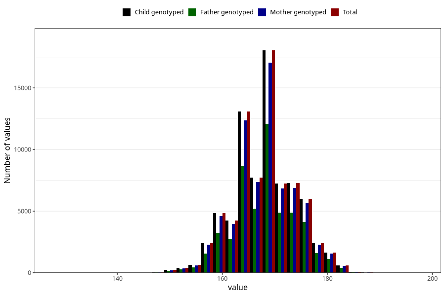

# mother_median_height
Variable created during phenotype curation.
- Number of values:

| Value | Total | Child genotyped | Mother genotyped | Father genotyped |
| ----- | ----- | --------------- | ---------------- | ---------------- |
| Missing | 4088 | 4088 | 3815 | 2192 |
| Non-missing | 76917 | 76917 | 72802 | 51412 |
| 25th percentile | 164 | 164 | 164 | 164 |
| 50th percentile | 168 | 168 | 168 | 168 |
| 75th percentile | 172 | 172 | 172 | 172 |
| Mean | 168.175682878947 | 168.175682878947 | 168.177714897942 | 168.217351980082 |
| Standard deviation | 5.87740963411492 | 5.87740963411492 | 5.88224083120842 | 5.86221235085083 |
| N | 76917 | 76917 | 72802 | 51412 |

