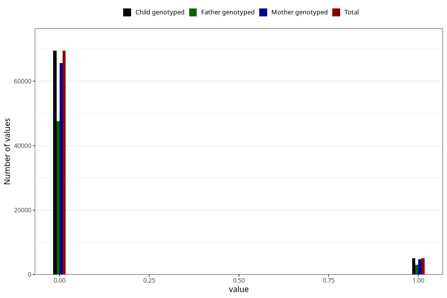

# mother_tongue_farfar
Variable mapping to `AA1313_D` in `Skjema1_v12`.
- Number of values:

| Value | Total | Child genotyped | Mother genotyped | Father genotyped |
| ----- | ----- | --------------- | ---------------- | ---------------- |
| Missing | 6511 | 6511 | 6154 | 2907 |
| Non-missing | 74494 | 74494 | 70463 | 50697 |
| 0 | 69440 | 69440 | 65689 | 47607 |
| 1 | 5054 | 5054 | 4774 | 3090 |

