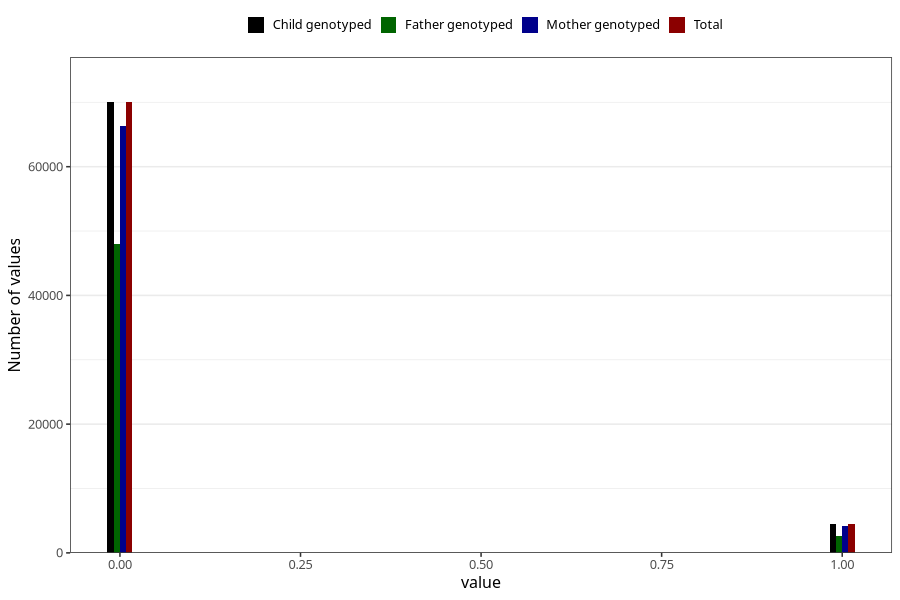

# mother_tongue_father
Variable mapping to `AA1307_D` in `Skjema1_v12`.
- Number of values:

| Value | Total | Child genotyped | Mother genotyped | Father genotyped |
| ----- | ----- | --------------- | ---------------- | ---------------- |
| Missing | 6511 | 6511 | 6154 | 2907 |
| Non-missing | 74494 | 74494 | 70463 | 50697 |
| 0 | 70018 | 70018 | 66247 | 48064 |
| 1 | 4476 | 4476 | 4216 | 2633 |

