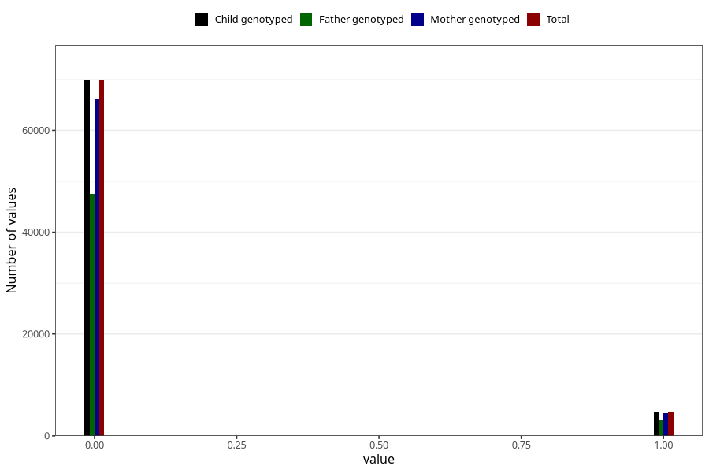

# mother_tongue_morfar
Variable mapping to `AA1311_D` in `Skjema1_v12`.
- Number of values:

| Value | Total | Child genotyped | Mother genotyped | Father genotyped |
| ----- | ----- | --------------- | ---------------- | ---------------- |
| Missing | 6511 | 6511 | 6154 | 2907 |
| Non-missing | 74494 | 74494 | 70463 | 50697 |
| 0 | 69793 | 69793 | 66038 | 47577 |
| 1 | 4701 | 4701 | 4425 | 3120 |

