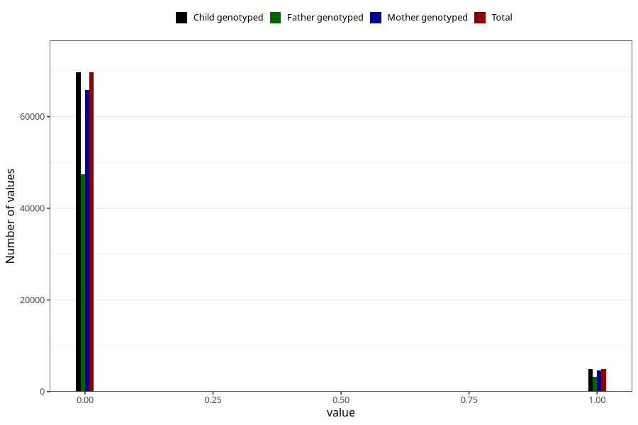

# mother_tongue_mormor
Variable mapping to `AA1310_D` in `Skjema1_v12`.
- Number of values:

| Value | Total | Child genotyped | Mother genotyped | Father genotyped |
| ----- | ----- | --------------- | ---------------- | ---------------- |
| Missing | 6511 | 6511 | 6154 | 2907 |
| Non-missing | 74494 | 74494 | 70463 | 50697 |
| 0 | 69642 | 69642 | 65885 | 47440 |
| 1 | 4852 | 4852 | 4578 | 3257 |

