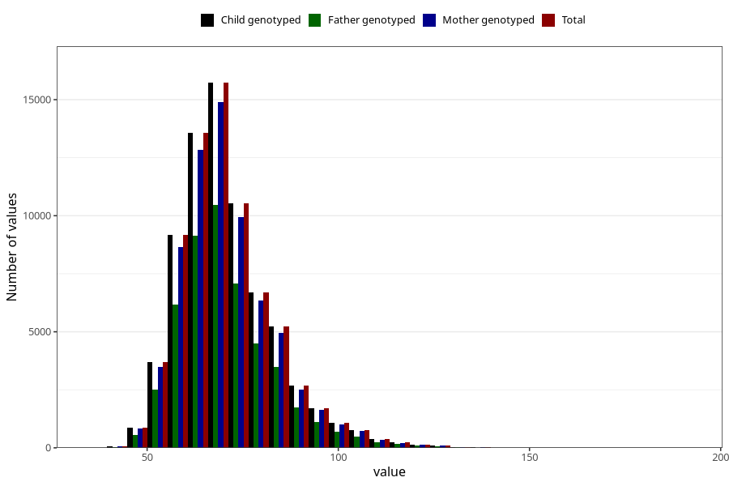

# mother_weight_15w
Variable mapping to `AA86` in `Skjema1_v12`.
- Number of values:

| Value | Total | Child genotyped | Mother genotyped | Father genotyped |
| ----- | ----- | --------------- | ---------------- | ---------------- |
| Missing | 8330 | 8330 | 7845 | 4998 |
| Non-missing | 72675 | 72675 | 68772 | 48606 |
| 25th percentile | 62 | 62 | 62 | 62 |
| 50th percentile | 69 | 69 | 69 | 69 |
| 75th percentile | 77 | 77 | 77 | 77 |
| Mean | 70.9085930512556 | 70.9085930512556 | 70.9079712673763 | 70.8343620129202 |
| Standard deviation | 12.4923775001228 | 12.4923775001228 | 12.4747940889765 | 12.4175805173995 |
| N | 72675 | 72675 | 68772 | 48606 |

