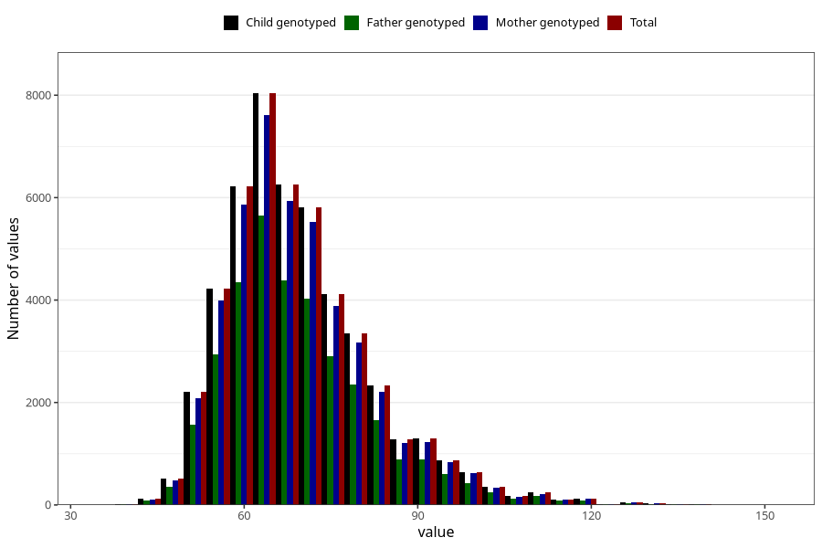

# mother_weight_18m
Variable mapping to `EE924` in `Skjema5_18mnd_v12`.
- Number of values:

| Value | Total | Child genotyped | Mother genotyped | Father genotyped |
| ----- | ----- | --------------- | ---------------- | ---------------- |
| Missing | 32541 | 32541 | 30753 | 19709 |
| Non-missing | 48464 | 48464 | 45864 | 33895 |
| 25th percentile | 60.5 | 60.5 | 60.5 | 60.5 |
| 50th percentile | 67 | 67 | 67 | 67 |
| 75th percentile | 76 | 76 | 76 | 76 |
| Mean | 69.6252909376032 | 69.6252909376032 | 69.6104984301413 | 69.5623307272459 |
| Standard deviation | 12.9201757478455 | 12.9201757478455 | 12.8852529203403 | 12.8298948706505 |
| N | 48464 | 48464 | 45864 | 33895 |

