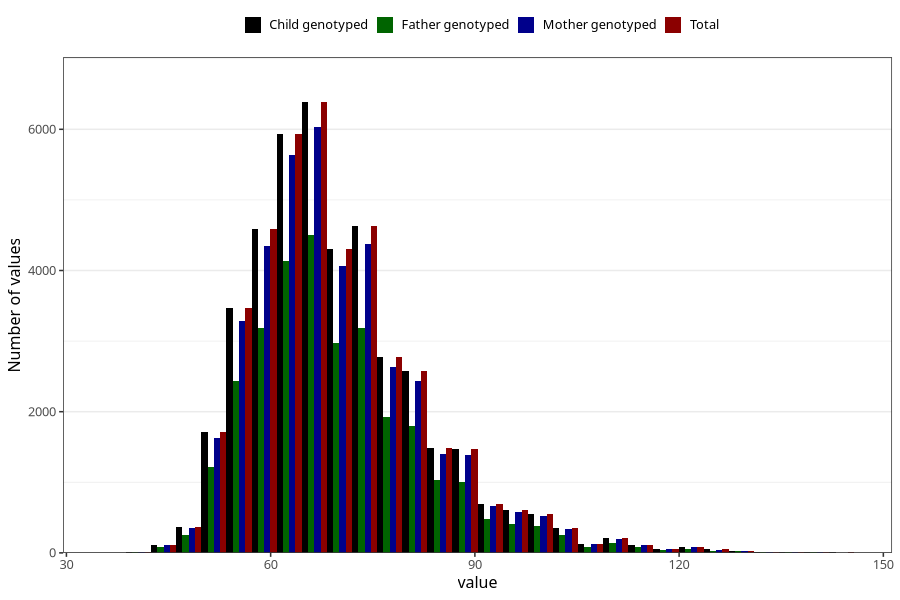

# mother_weight_3y
Variable mapping to `GG501` in `Skjema6_3aar_v12`.
- Number of values:

| Value | Total | Child genotyped | Mother genotyped | Father genotyped |
| ----- | ----- | --------------- | ---------------- | ---------------- |
| Missing | 38242 | 38242 | 36169 | 23891 |
| Non-missing | 42763 | 42763 | 40448 | 29713 |
| 25th percentile | 61 | 61 | 61 | 61 |
| 50th percentile | 68 | 68 | 68 | 68 |
| 75th percentile | 76 | 76 | 76 | 76 |
| Mean | 69.9498725533756 | 69.9498725533756 | 69.9258084454114 | 69.8693635782318 |
| Standard deviation | 12.8577459005561 | 12.8577459005561 | 12.8330947641016 | 12.7724987351204 |
| N | 42763 | 42763 | 40448 | 29713 |

