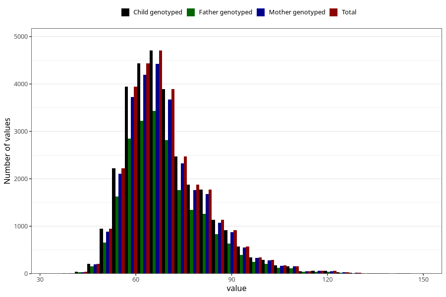

# mother_weight_5y
Variable mapping to `LL339` in `Skjema5aar_v12`.
- Number of values:

| Value | Total | Child genotyped | Mother genotyped | Father genotyped |
| ----- | ----- | --------------- | ---------------- | ---------------- |
| Missing | 50635 | 50635 | 47941 | 31721 |
| Non-missing | 30370 | 30370 | 28676 | 21883 |
| 25th percentile | 61 | 61 | 61 | 61 |
| 50th percentile | 67 | 67 | 67 | 67 |
| 75th percentile | 75.5 | 75.5 | 75.5 | 75 |
| Mean | 69.535943365163 | 69.535943365163 | 69.5311026642488 | 69.4397797376959 |
| Standard deviation | 12.6013515880919 | 12.6013515880919 | 12.5975454488202 | 12.4792867809908 |
| N | 30370 | 30370 | 28676 | 21883 |

