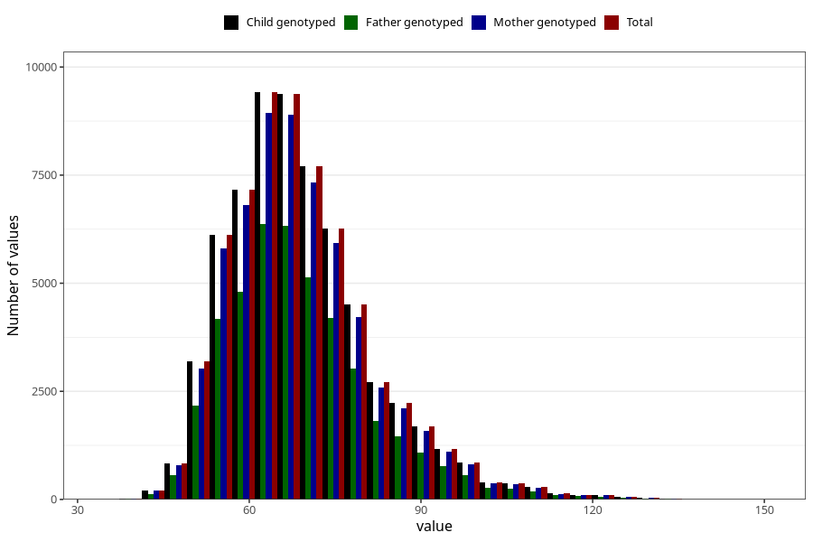

# mother_weight_6m
Variable mapping to `DD673` in `Skjema4_6mnd_v12`.
- Number of values:

| Value | Total | Child genotyped | Mother genotyped | Father genotyped |
| ----- | ----- | --------------- | ---------------- | ---------------- |
| Missing | 16026 | 16026 | 15039 | 9964 |
| Non-missing | 64979 | 64979 | 61578 | 43640 |
| 25th percentile | 60 | 60 | 60 | 60 |
| 50th percentile | 67 | 67 | 67 | 67 |
| 75th percentile | 75 | 75 | 75 | 75 |
| Mean | 69.0538096923622 | 69.0538096923622 | 69.0263194647439 | 68.9770439963336 |
| Standard deviation | 12.7812789346927 | 12.7812789346927 | 12.7531072570798 | 12.7744156229918 |
| N | 64979 | 64979 | 61578 | 43640 |

