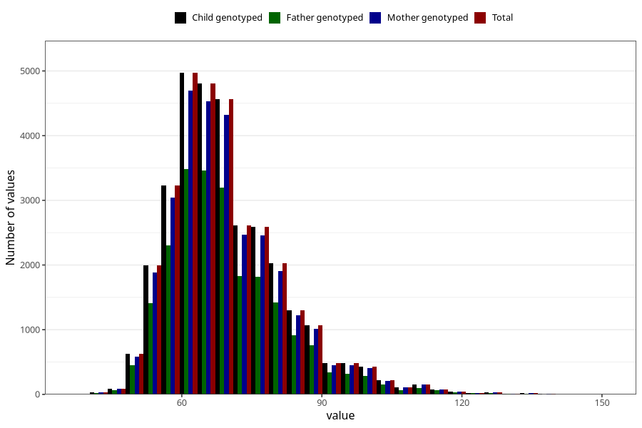

# mother_weight_8y
Variable mapping to `NN284` in `Skjema8aar_v12`.
- Number of values:

| Value | Total | Child genotyped | Mother genotyped | Father genotyped |
| ----- | ----- | --------------- | ---------------- | ---------------- |
| Missing | 48977 | 48977 | 46383 | 31044 |
| Non-missing | 32028 | 32028 | 30234 | 22560 |
| 25th percentile | 61 | 61 | 61 | 61 |
| 50th percentile | 68 | 68 | 68 | 67.5 |
| 75th percentile | 76 | 76 | 76 | 75.3 |
| Mean | 69.7871081553641 | 69.7871081553641 | 69.7664715221274 | 69.6583554964539 |
| Standard deviation | 12.5810267449646 | 12.5810267449646 | 12.5618261730887 | 12.4797002329251 |
| N | 32028 | 32028 | 30234 | 22560 |

