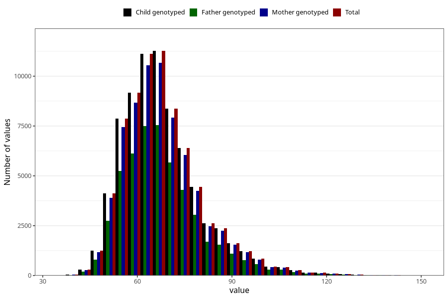

# mother_weight_beginning_self
Variable mapping to `AA85` in `Skjema1_v12`.
- Number of values:

| Value | Total | Child genotyped | Mother genotyped | Father genotyped |
| ----- | ----- | --------------- | ---------------- | ---------------- |
| Missing | 6216 | 6216 | 5836 | 3585 |
| Non-missing | 74789 | 74789 | 70781 | 50019 |
| 25th percentile | 59 | 59 | 59 | 60 |
| 50th percentile | 65 | 65 | 65 | 65 |
| 75th percentile | 74 | 74 | 74 | 74 |
| Mean | 67.9983687440666 | 67.9983687440666 | 67.9960017518826 | 67.9891241328295 |
| Standard deviation | 12.711256913502 | 12.711256913502 | 12.690179641983 | 12.6568784028701 |
| N | 74789 | 74789 | 70781 | 50019 |

