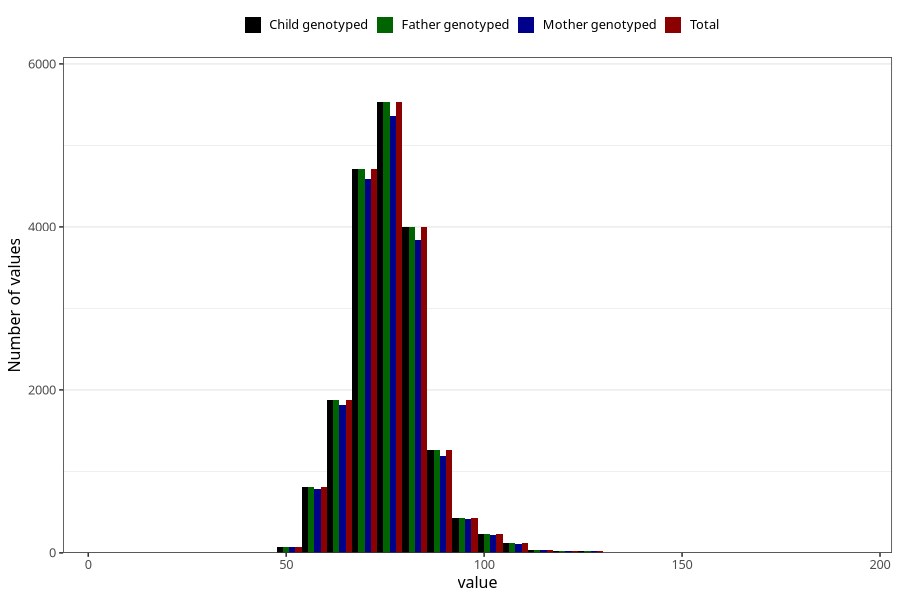

# weight_age_18_father15
Variable mapping to `G__7_1` in `Far2_V12`.
- Number of values:

| Value | Total | Child genotyped | Mother genotyped | Father genotyped |
| ----- | ----- | --------------- | ---------------- | ---------------- |
| Missing | 61870 | 61870 | 58115 | 34469 |
| Non-missing | 19135 | 19135 | 18502 | 19135 |
| 25th percentile | 70 | 70 | 70 | 70 |
| 50th percentile | 75 | 75 | 75 | 75 |
| 75th percentile | 80 | 80 | 80 | 80 |
| Mean | 75.6115495165926 | 75.6115495165926 | 75.5868014268728 | 75.6115495165926 |
| Standard deviation | 9.72150524555781 | 9.72150524555781 | 9.70058230520595 | 9.72150524555781 |
| N | 19135 | 19135 | 18502 | 19135 |

