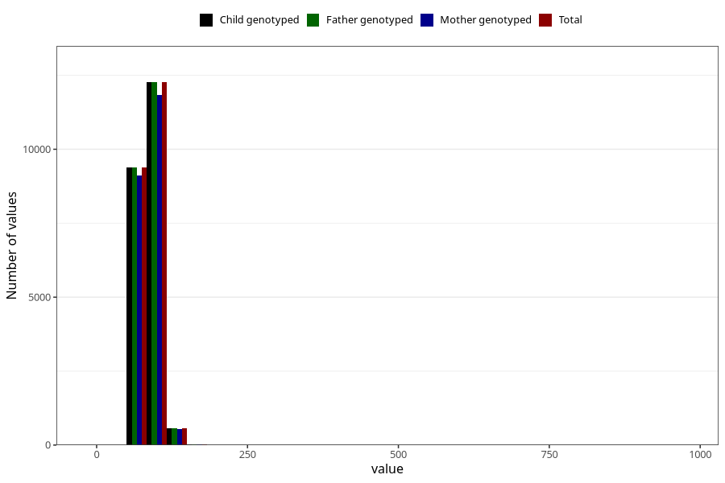

# weight_father15
Variable mapping to `G__6` in `Far2_V12`.
- Number of values:

| Value | Total | Child genotyped | Mother genotyped | Father genotyped |
| ----- | ----- | --------------- | ---------------- | ---------------- |
| Missing | 58760 | 58760 | 55116 | 31359 |
| Non-missing | 22245 | 22245 | 21501 | 22245 |
| 25th percentile | 79 | 79 | 79 | 79 |
| 50th percentile | 85 | 85 | 85 | 85 |
| 75th percentile | 95 | 95 | 95 | 95 |
| Mean | 87.3452910766464 | 87.3452910766464 | 87.3045439746988 | 87.3452910766464 |
| Standard deviation | 14.1582477731324 | 14.1582477731324 | 14.1582088048113 | 14.1582477731324 |
| N | 22245 | 22245 | 21501 | 22245 |

