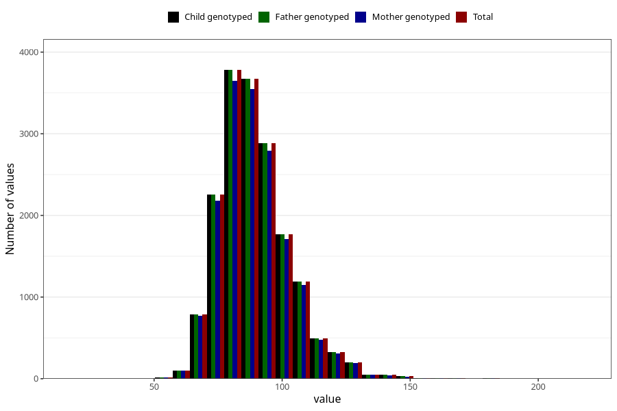

# weight_hf
Variable mapping to `HF128` in `HelseFedre`.
- Number of values:

| Value | Total | Child genotyped | Mother genotyped | Father genotyped |
| ----- | ----- | --------------- | ---------------- | ---------------- |
| Missing | 63357 | 63357 | 59560 | 35956 |
| Non-missing | 17648 | 17648 | 17057 | 17648 |
| 25th percentile | 80 | 80 | 80 | 80 |
| 50th percentile | 88 | 88 | 88 | 88 |
| 75th percentile | 97 | 97 | 97 | 97 |
| Mean | 89.4605621033545 | 89.4605621033545 | 89.4365363193997 | 89.4605621033545 |
| Standard deviation | 13.9746724066882 | 13.9746724066882 | 13.9324909085843 | 13.9746724066882 |
| N | 17648 | 17648 | 17057 | 17648 |

