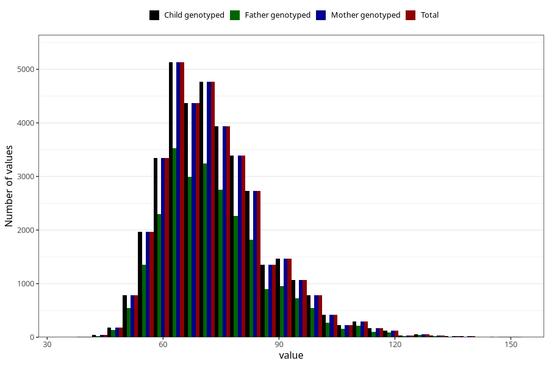

# weight_hm
Variable mapping to `HM260` in `HelseModre`.
- Number of values:

| Value | Total | Child genotyped | Mother genotyped | Father genotyped |
| ----- | ----- | --------------- | ---------------- | ---------------- |
| Missing | 44255 | 44255 | 39867 | 28558 |
| Non-missing | 36750 | 36750 | 36750 | 25046 |
| 25th percentile | 64 | 64 | 64 | 64 |
| 50th percentile | 71 | 71 | 71 | 71 |
| 75th percentile | 80 | 80 | 80 | 80 |
| Mean | 73.6136054421769 | 73.6136054421769 | 73.6136054421769 | 73.5020761798291 |
| Standard deviation | 13.7016995160648 | 13.7016995160648 | 13.7016995160648 | 13.689666290596 |
| N | 36750 | 36750 | 36750 | 25046 |

