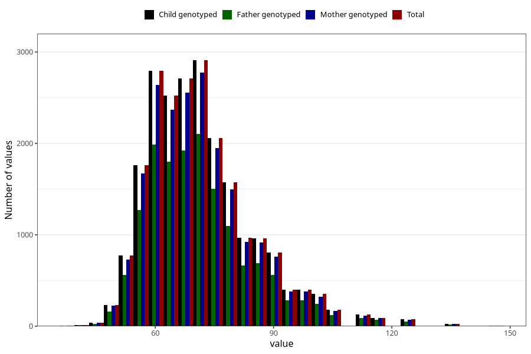

# weight_mother_14m
Variable mapping to `UM272` in `Ungdomsskjema_Mor_v12_standard`.
- Number of values:

| Value | Total | Child genotyped | Mother genotyped | Father genotyped |
| ----- | ----- | --------------- | ---------------- | ---------------- |
| Missing | 59237 | 59237 | 56028 | 38083 |
| Non-missing | 21768 | 21768 | 20589 | 15521 |
| 25th percentile | 62 | 62 | 62 | 62 |
| 50th percentile | 70 | 70 | 70 | 70 |
| 75th percentile | 79 | 79 | 79 | 78 |
| Mean | 71.6679988974642 | 71.6679988974642 | 71.6571955898781 | 71.623477868694 |
| Standard deviation | 13.2631563581831 | 13.2631563581831 | 13.2402998986549 | 13.2582293173129 |
| N | 21768 | 21768 | 20589 | 15521 |

