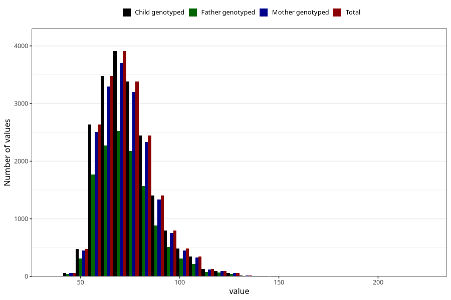

# weight_now_45m
Variable mapping to `LM29` in `MobaForeldre45_Mor_v12_standard`.
- Number of values:

| Value | Total | Child genotyped | Mother genotyped | Father genotyped |
| ----- | ----- | --------------- | ---------------- | ---------------- |
| Missing | 61248 | 61248 | 57904 | 40803 |
| Non-missing | 19757 | 19757 | 18713 | 12801 |
| 25th percentile | 64 | 64 | 64 | 64 |
| 50th percentile | 71 | 71 | 71 | 71 |
| 75th percentile | 80 | 80 | 80 | 80 |
| Mean | 73.7509338462317 | 73.7509338462317 | 73.7308983059905 | 73.6182954456683 |
| Standard deviation | 14.0715276363937 | 14.0715276363937 | 14.0264740727834 | 14.1137831436337 |
| N | 19757 | 19757 | 18713 | 12801 |

