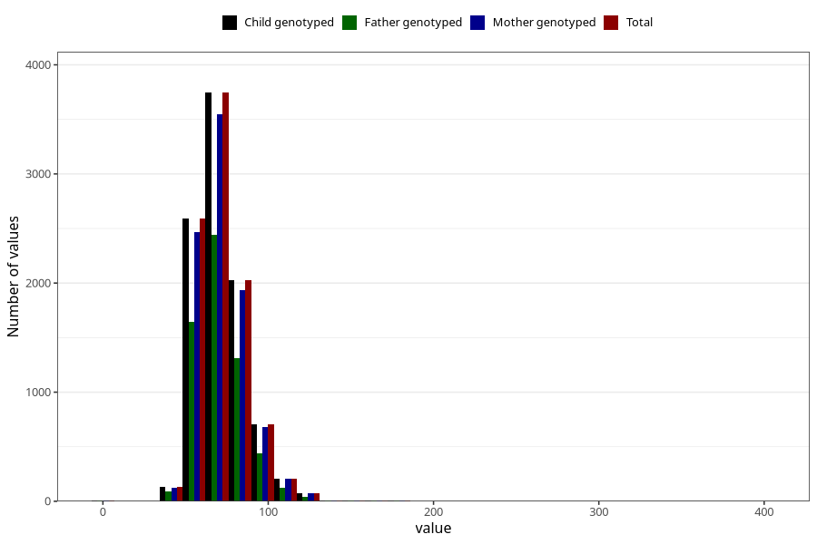

# weight_ung
Variable mapping to `UH52` in `UngHelse_standard`.
- Number of values:

| Value | Total | Child genotyped | Mother genotyped | Father genotyped |
| ----- | ----- | --------------- | ---------------- | ---------------- |
| Missing | 71475 | 71475 | 67551 | 47474 |
| Non-missing | 9530 | 9530 | 9066 | 6130 |
| 25th percentile | 61 | 61 | 61 | 61 |
| 50th percentile | 70 | 70 | 70 | 70 |
| 75th percentile | 80 | 80 | 80 | 80 |
| Mean | 71.5341028331584 | 71.5341028331584 | 71.5755570262519 | 71.3535073409462 |
| Standard deviation | 15.4549145291078 | 15.4549145291078 | 15.468063083606 | 14.9603105175077 |
| N | 9530 | 9530 | 9066 | 6130 |

