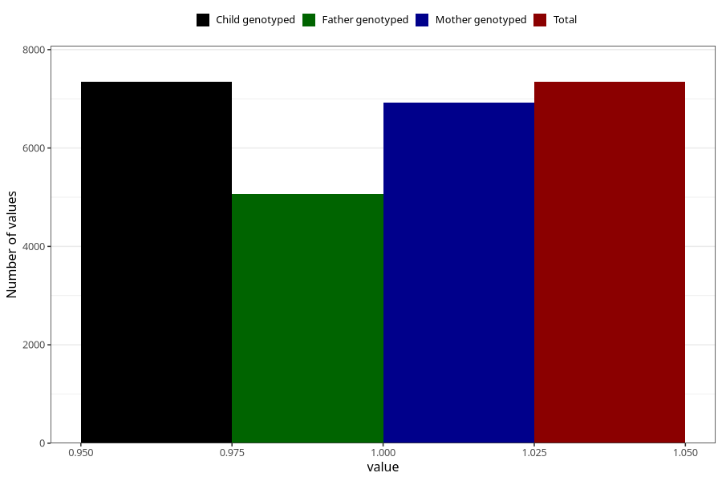

# abdominal_pain_13w_15w
Variable mapping to `AA189` in `Skjema1_v12`.
- Number of values:

| Value | Total | Child genotyped | Mother genotyped | Father genotyped |
| ----- | ----- | --------------- | ---------------- | ---------------- |
| Missing | 73662 | 73662 | 69694 | 48533 |
| Non-missing | 7343 | 7343 | 6923 | 5071 |
| 1 | 7343 | 7343 | 6923 | 5071 |

