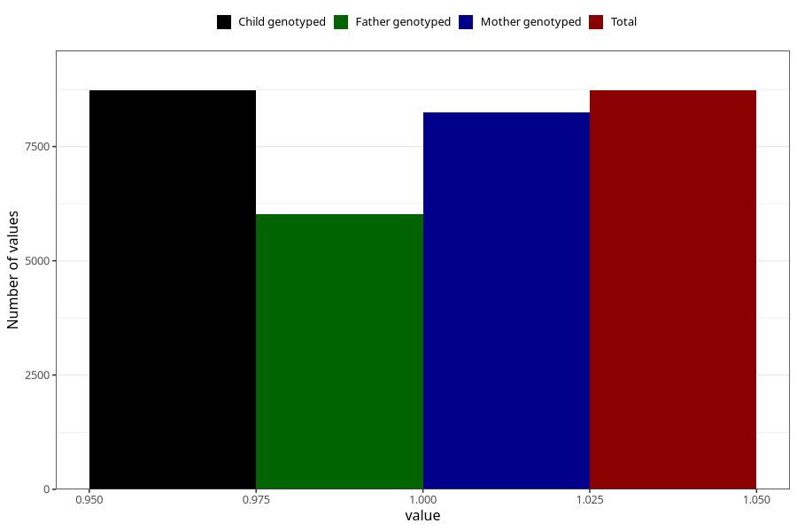

# abdominal_pain_5w_8w
Variable mapping to `AA187` in `Skjema1_v12`.
- Number of values:

| Value | Total | Child genotyped | Mother genotyped | Father genotyped |
| ----- | ----- | --------------- | ---------------- | ---------------- |
| Missing | 72277 | 72277 | 68373 | 47593 |
| Non-missing | 8728 | 8728 | 8244 | 6011 |
| 1 | 8728 | 8728 | 8244 | 6011 |

