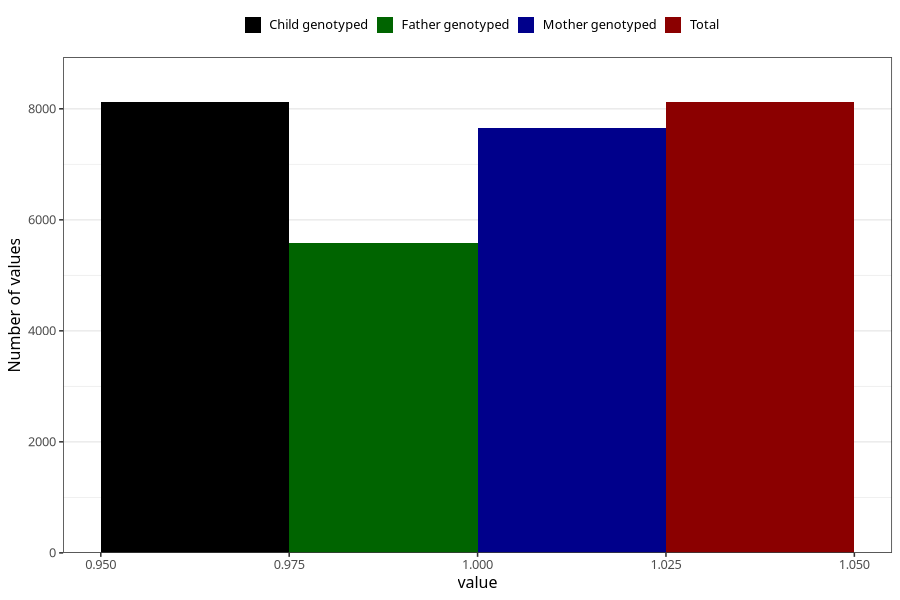

# abdominal_pain_9w_12w
Variable mapping to `AA188` in `Skjema1_v12`.
- Number of values:

| Value | Total | Child genotyped | Mother genotyped | Father genotyped |
| ----- | ----- | --------------- | ---------------- | ---------------- |
| Missing | 72886 | 72886 | 68970 | 48026 |
| Non-missing | 8119 | 8119 | 7647 | 5578 |
| 1 | 8119 | 8119 | 7647 | 5578 |

