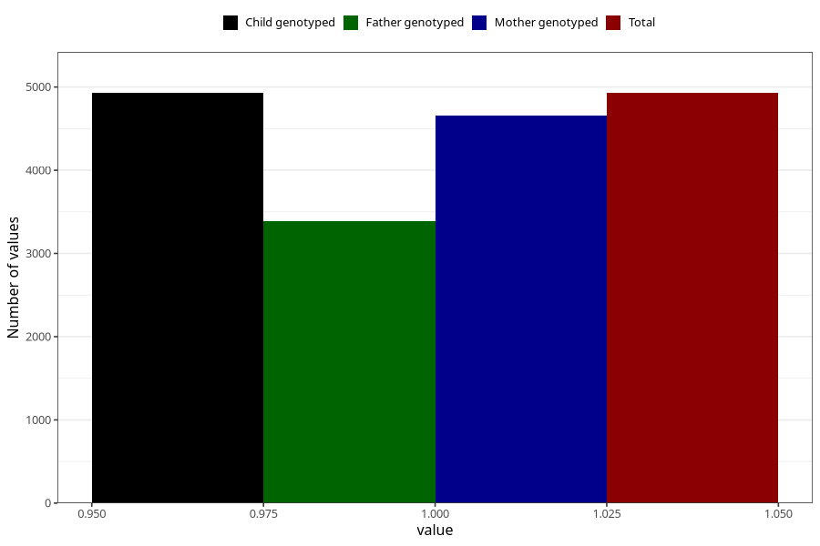

# abdominal_pain_before_4w
Variable mapping to `AA186` in `Skjema1_v12`.
- Number of values:

| Value | Total | Child genotyped | Mother genotyped | Father genotyped |
| ----- | ----- | --------------- | ---------------- | ---------------- |
| Missing | 76077 | 76077 | 71965 | 50219 |
| Non-missing | 4928 | 4928 | 4652 | 3385 |
| 1 | 4928 | 4928 | 4652 | 3385 |

