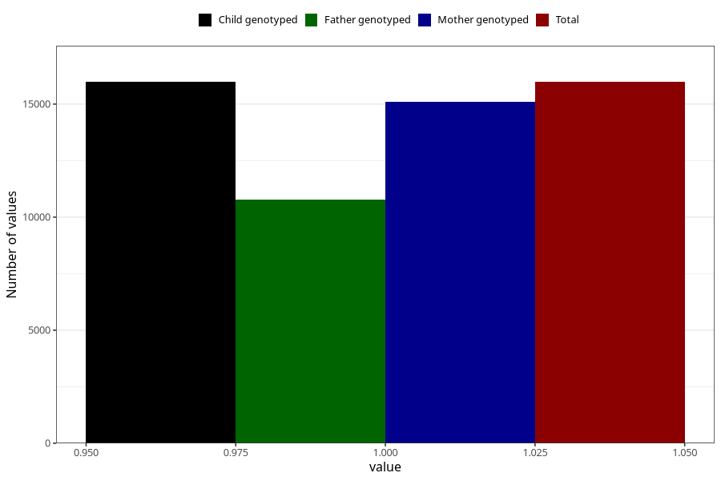

# back_pain_13w_15w
Variable mapping to `AA199` in `Skjema1_v12`.
- Number of values:

| Value | Total | Child genotyped | Mother genotyped | Father genotyped |
| ----- | ----- | --------------- | ---------------- | ---------------- |
| Missing | 65025 | 65025 | 61516 | 42816 |
| Non-missing | 15980 | 15980 | 15101 | 10788 |
| 1 | 15980 | 15980 | 15101 | 10788 |

