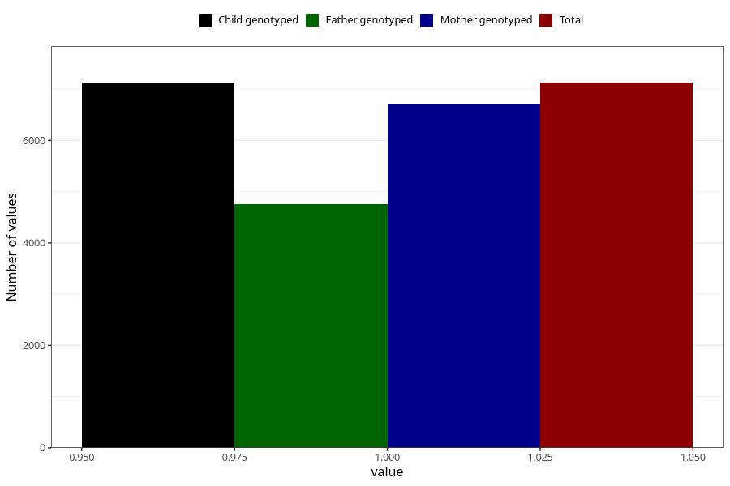

# back_pain_13w_16w
Variable mapping to `CC352` in `Skjema3_v12`.
- Number of values:

| Value | Total | Child genotyped | Mother genotyped | Father genotyped |
| ----- | ----- | --------------- | ---------------- | ---------------- |
| Missing | 73879 | 73879 | 69893 | 48847 |
| Non-missing | 7126 | 7126 | 6724 | 4757 |
| 1 | 7126 | 7126 | 6724 | 4757 |

