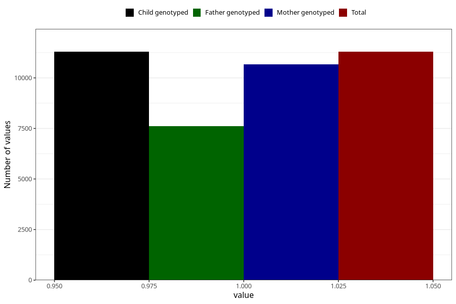

# back_pain_17w_20w
Variable mapping to `CC353` in `Skjema3_v12`.
- Number of values:

| Value | Total | Child genotyped | Mother genotyped | Father genotyped |
| ----- | ----- | --------------- | ---------------- | ---------------- |
| Missing | 69715 | 69715 | 65944 | 45995 |
| Non-missing | 11290 | 11290 | 10673 | 7609 |
| 1 | 11290 | 11290 | 10673 | 7609 |

