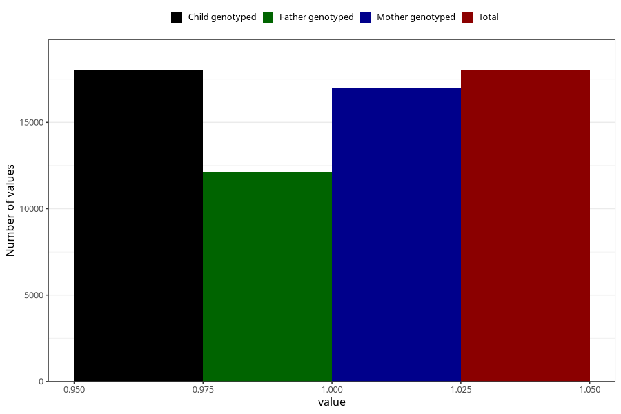

# back_pain_21w_24w
Variable mapping to `CC354` in `Skjema3_v12`.
- Number of values:

| Value | Total | Child genotyped | Mother genotyped | Father genotyped |
| ----- | ----- | --------------- | ---------------- | ---------------- |
| Missing | 63005 | 63005 | 59626 | 41478 |
| Non-missing | 18000 | 18000 | 16991 | 12126 |
| 1 | 18000 | 18000 | 16991 | 12126 |

