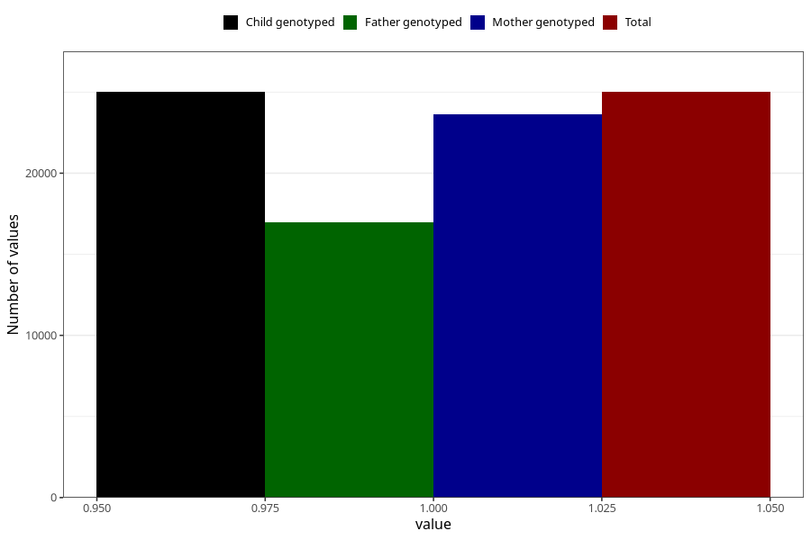

# back_pain_25w_28w
Variable mapping to `CC355` in `Skjema3_v12`.
- Number of values:

| Value | Total | Child genotyped | Mother genotyped | Father genotyped |
| ----- | ----- | --------------- | ---------------- | ---------------- |
| Missing | 55998 | 55998 | 52975 | 36651 |
| Non-missing | 25007 | 25007 | 23642 | 16953 |
| 1 | 25007 | 25007 | 23642 | 16953 |

