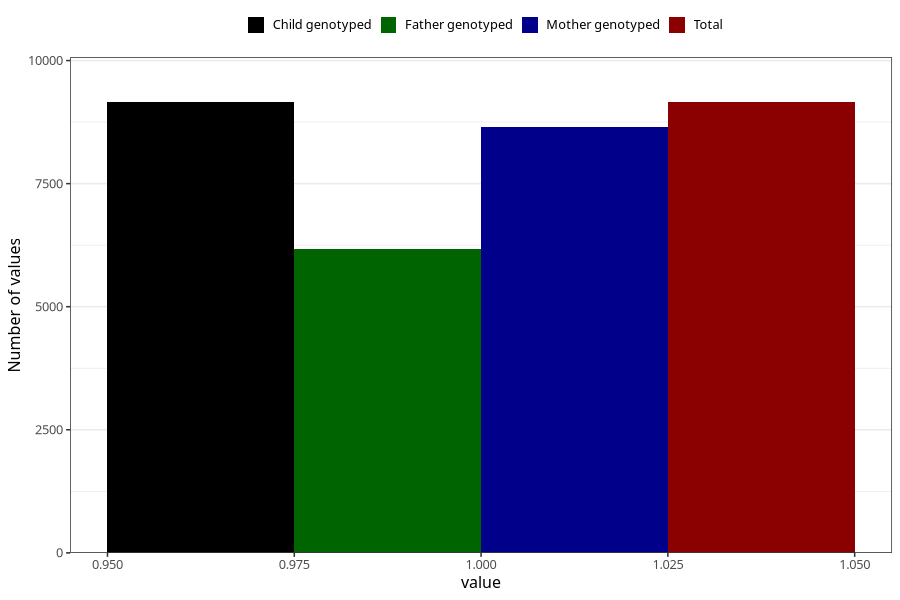

# back_pain_9w_12w
Variable mapping to `AA198` in `Skjema1_v12`.
- Number of values:

| Value | Total | Child genotyped | Mother genotyped | Father genotyped |
| ----- | ----- | --------------- | ---------------- | ---------------- |
| Missing | 71851 | 71851 | 67957 | 47442 |
| Non-missing | 9154 | 9154 | 8660 | 6162 |
| 1 | 9154 | 9154 | 8660 | 6162 |

