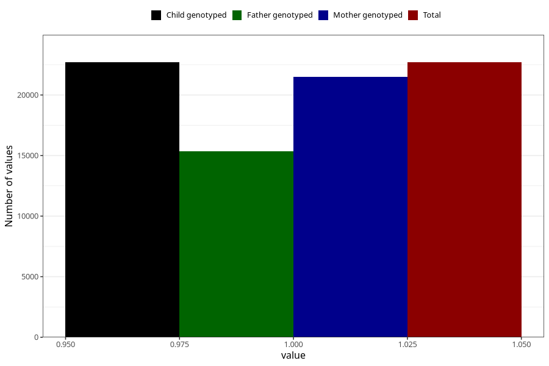

# back_pain_after_29w
Variable mapping to `CC356` in `Skjema3_v12`.
- Number of values:

| Value | Total | Child genotyped | Mother genotyped | Father genotyped |
| ----- | ----- | --------------- | ---------------- | ---------------- |
| Missing | 58312 | 58312 | 55143 | 38249 |
| Non-missing | 22693 | 22693 | 21474 | 15355 |
| 1 | 22693 | 22693 | 21474 | 15355 |

