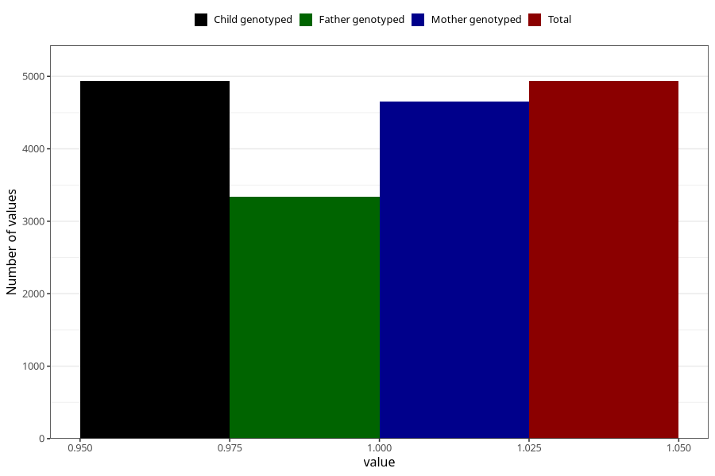

# blood_haemoglobin_dont_know_30w
Variable mapping to `CC130` in `Skjema3_v12`.
- Number of values:

| Value | Total | Child genotyped | Mother genotyped | Father genotyped |
| ----- | ----- | --------------- | ---------------- | ---------------- |
| Missing | 76070 | 76070 | 71965 | 50267 |
| Non-missing | 4935 | 4935 | 4652 | 3337 |
| 1 | 4935 | 4935 | 4652 | 3337 |

