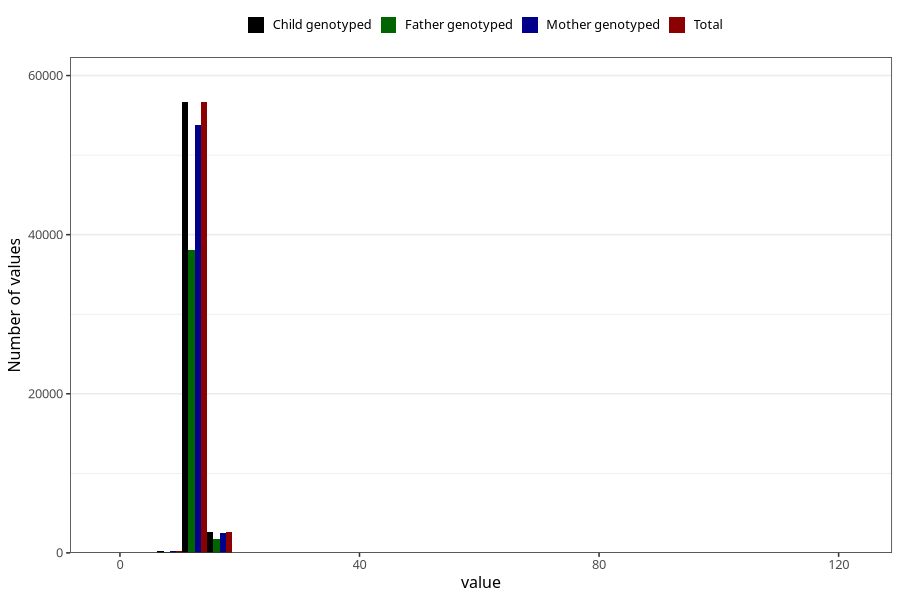

# blood_haemoglobin_highest_30w
Variable mapping to `CC126` in `Skjema3_v12`.
- Number of values:

| Value | Total | Child genotyped | Mother genotyped | Father genotyped |
| ----- | ----- | --------------- | ---------------- | ---------------- |
| Missing | 21389 | 21389 | 20045 | 13544 |
| Non-missing | 59616 | 59616 | 56572 | 40060 |
| 25th percentile | 12.3 | 12.3 | 12.3 | 12.3 |
| 50th percentile | 12.9 | 12.9 | 12.9 | 12.9 |
| 75th percentile | 13.5 | 13.5 | 13.5 | 13.525 |
| Mean | 13.0038479602791 | 13.0038479602791 | 13.001979777982 | 13.006562656016 |
| Standard deviation | 2.37597905687393 | 2.37597905687393 | 2.33756691715988 | 2.22645623885865 |
| N | 59616 | 59616 | 56572 | 40060 |

