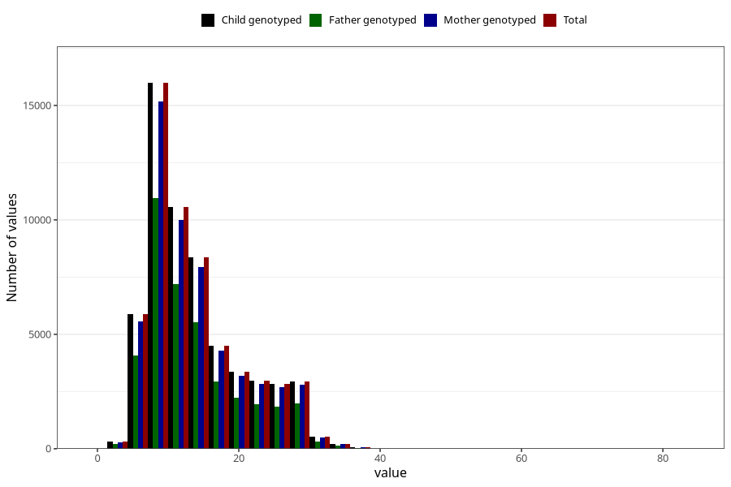

# blood_haemoglobin_highest_week_30w
Variable mapping to `CC127` in `Skjema3_v12`.
- Number of values:

| Value | Total | Child genotyped | Mother genotyped | Father genotyped |
| ----- | ----- | --------------- | ---------------- | ---------------- |
| Missing | 22493 | 22493 | 21081 | 14246 |
| Non-missing | 58512 | 58512 | 55536 | 39358 |
| 25th percentile | 9 | 9 | 9 | 9 |
| 50th percentile | 12 | 12 | 12 | 12 |
| 75th percentile | 17 | 17 | 17 | 17 |
| Mean | 13.9624692370796 | 13.9624692370796 | 13.9607281763181 | 13.8334264952487 |
| Standard deviation | 6.6576708691967 | 6.6576708691967 | 6.65722961809456 | 6.60234606042501 |
| N | 58512 | 58512 | 55536 | 39358 |

