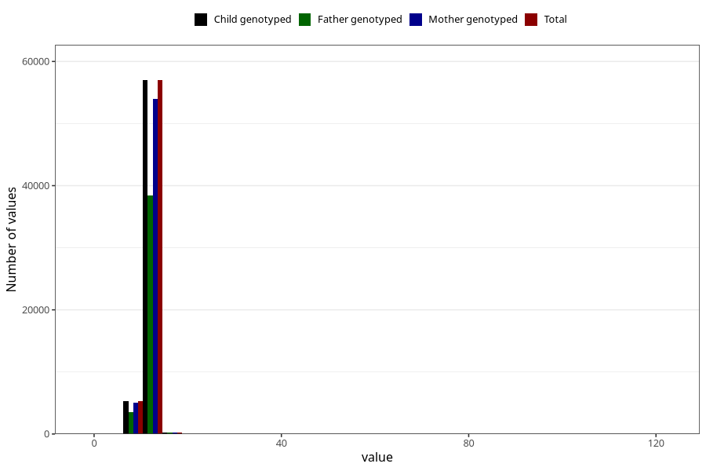

# blood_haemoglobin_last_check_30w
Variable mapping to `CC124` in `Skjema3_v12`.
- Number of values:

| Value | Total | Child genotyped | Mother genotyped | Father genotyped |
| ----- | ----- | --------------- | ---------------- | ---------------- |
| Missing | 18272 | 18272 | 17154 | 11420 |
| Non-missing | 62733 | 62733 | 59463 | 42184 |
| 25th percentile | 11.2 | 11.2 | 11.2 | 11.2 |
| 50th percentile | 11.8 | 11.8 | 11.8 | 11.9 |
| 75th percentile | 12.5 | 12.5 | 12.5 | 12.5 |
| Mean | 11.9311271579551 | 11.9311271579551 | 11.9306980811597 | 11.932296605348 |
| Standard deviation | 2.60637026837633 | 2.60637026837633 | 2.62671245213283 | 2.36823761358976 |
| N | 62733 | 62733 | 59463 | 42184 |

