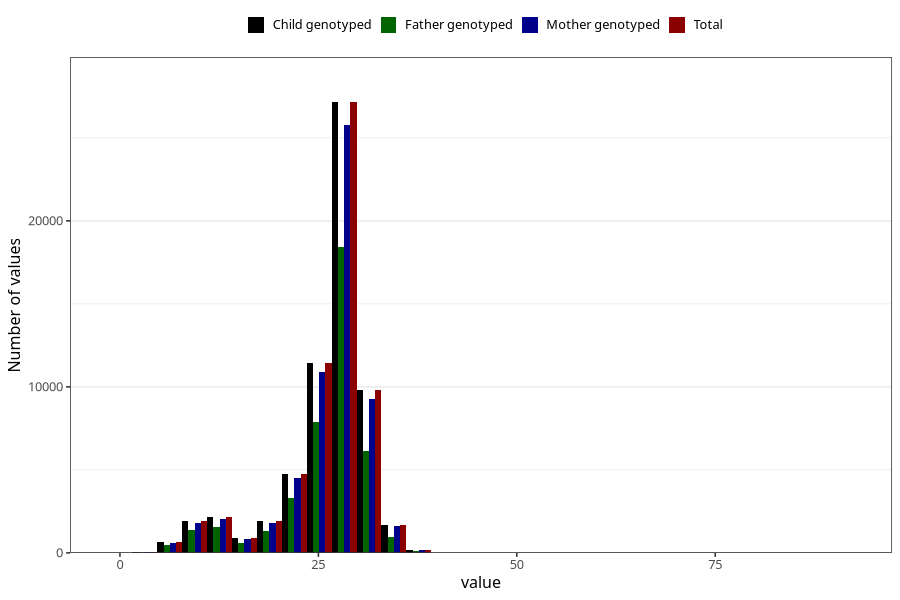

# blood_haemoglobin_last_check_week_30w
Variable mapping to `CC125` in `Skjema3_v12`.
- Number of values:

| Value | Total | Child genotyped | Mother genotyped | Father genotyped |
| ----- | ----- | --------------- | ---------------- | ---------------- |
| Missing | 18345 | 18345 | 17227 | 11436 |
| Non-missing | 62660 | 62660 | 59390 | 42168 |
| 25th percentile | 25 | 25 | 25 | 24 |
| 50th percentile | 28 | 28 | 28 | 27 |
| 75th percentile | 29 | 29 | 29 | 29 |
| Mean | 25.8671401212895 | 25.8671401212895 | 25.8758881966661 | 25.6931085183077 |
| Standard deviation | 5.63704675931535 | 5.63704675931535 | 5.6273839151087 | 5.69083040715225 |
| N | 62660 | 62660 | 59390 | 42168 |

