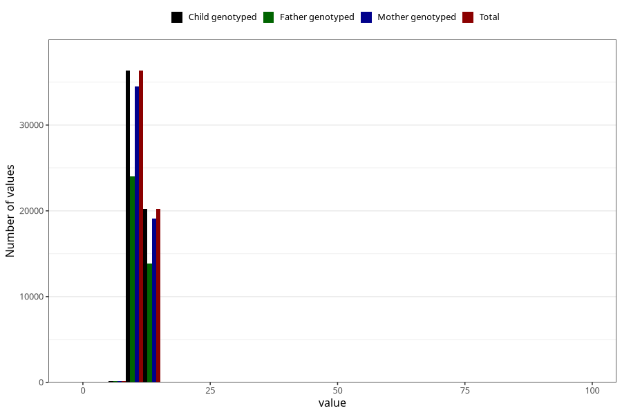

# blood_haemoglobin_lowest_30w
Variable mapping to `CC128` in `Skjema3_v12`.
- Number of values:

| Value | Total | Child genotyped | Mother genotyped | Father genotyped |
| ----- | ----- | --------------- | ---------------- | ---------------- |
| Missing | 24183 | 24183 | 22683 | 15494 |
| Non-missing | 56822 | 56822 | 53934 | 38110 |
| 25th percentile | 10.9 | 10.9 | 10.8 | 10.9 |
| 50th percentile | 11.5 | 11.5 | 11.5 | 11.5 |
| 75th percentile | 12.1 | 12.1 | 12.1 | 12.2 |
| Mean | 11.5375822744712 | 11.5375822744712 | 11.535854933808 | 11.5432301233272 |
| Standard deviation | 2.19100667557676 | 2.19100667557676 | 2.19277972870683 | 1.91780691761883 |
| N | 56822 | 56822 | 53934 | 38110 |

