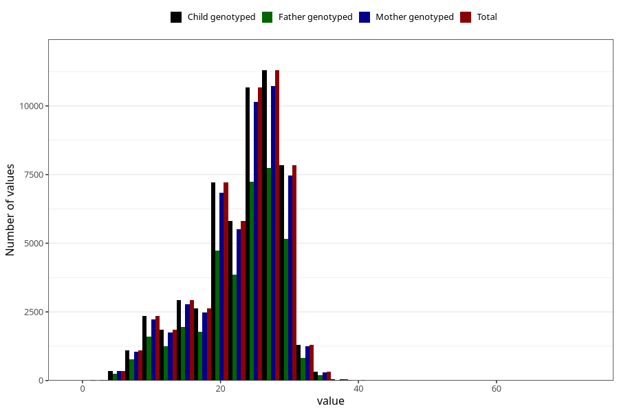

# blood_haemoglobin_lowest_week_30w
Variable mapping to `CC129` in `Skjema3_v12`.
- Number of values:

| Value | Total | Child genotyped | Mother genotyped | Father genotyped |
| ----- | ----- | --------------- | ---------------- | ---------------- |
| Missing | 25256 | 25256 | 23698 | 16203 |
| Non-missing | 55749 | 55749 | 52919 | 37401 |
| 25th percentile | 20 | 20 | 20 | 20 |
| 50th percentile | 24 | 24 | 24 | 24 |
| 75th percentile | 28 | 28 | 28 | 28 |
| Mean | 23.1357513139249 | 23.1357513139249 | 23.1394773143861 | 23.091494879816 |
| Standard deviation | 6.17481197863697 | 6.17481197863697 | 6.17535973056871 | 6.18111429417714 |
| N | 55749 | 55749 | 52919 | 37401 |

