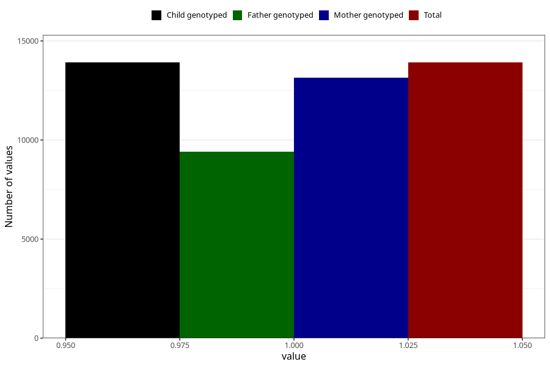

# common_cold_13w_15w
Variable mapping to `AA349` in `Skjema1_v12`.
- Number of values:

| Value | Total | Child genotyped | Mother genotyped | Father genotyped |
| ----- | ----- | --------------- | ---------------- | ---------------- |
| Missing | 67094 | 67094 | 63464 | 44206 |
| Non-missing | 13911 | 13911 | 13153 | 9398 |
| 1 | 13911 | 13911 | 13153 | 9398 |

