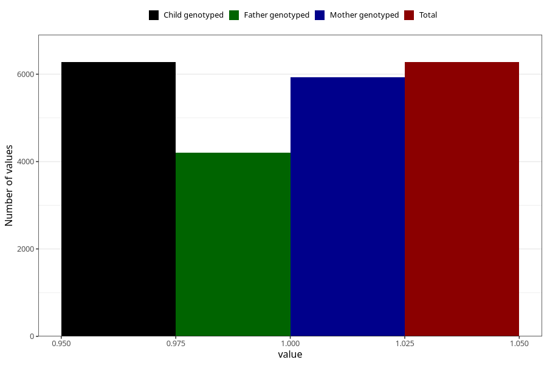

# common_cold_5w_8w
Variable mapping to `AA347` in `Skjema1_v12`.
- Number of values:

| Value | Total | Child genotyped | Mother genotyped | Father genotyped |
| ----- | ----- | --------------- | ---------------- | ---------------- |
| Missing | 74730 | 74730 | 70681 | 49400 |
| Non-missing | 6275 | 6275 | 5936 | 4204 |
| 1 | 6275 | 6275 | 5936 | 4204 |

