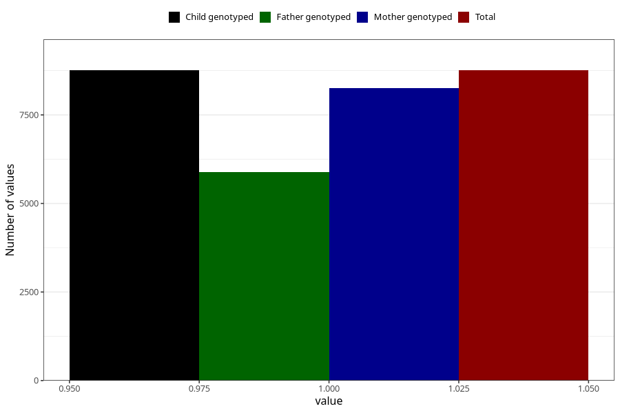

# common_cold_9w_12w
Variable mapping to `AA348` in `Skjema1_v12`.
- Number of values:

| Value | Total | Child genotyped | Mother genotyped | Father genotyped |
| ----- | ----- | --------------- | ---------------- | ---------------- |
| Missing | 72247 | 72247 | 68358 | 47721 |
| Non-missing | 8758 | 8758 | 8259 | 5883 |
| 1 | 8758 | 8758 | 8259 | 5883 |

