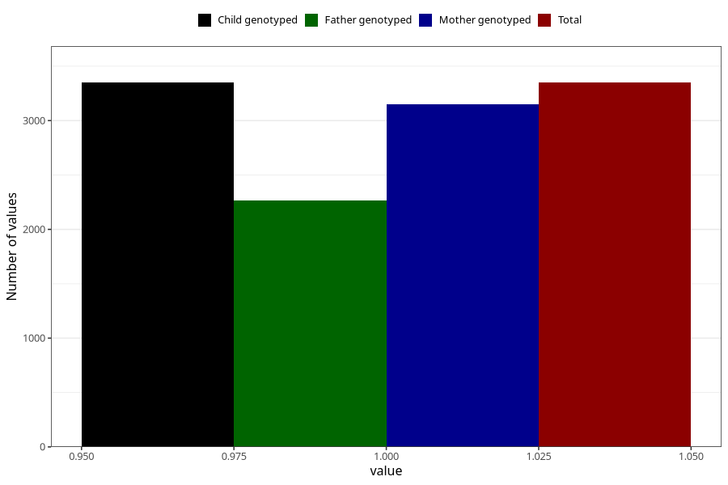

# common_cold_before_4w
Variable mapping to `AA346` in `Skjema1_v12`.
- Number of values:

| Value | Total | Child genotyped | Mother genotyped | Father genotyped |
| ----- | ----- | --------------- | ---------------- | ---------------- |
| Missing | 77656 | 77656 | 73466 | 51338 |
| Non-missing | 3349 | 3349 | 3151 | 2266 |
| 1 | 3349 | 3349 | 3151 | 2266 |

