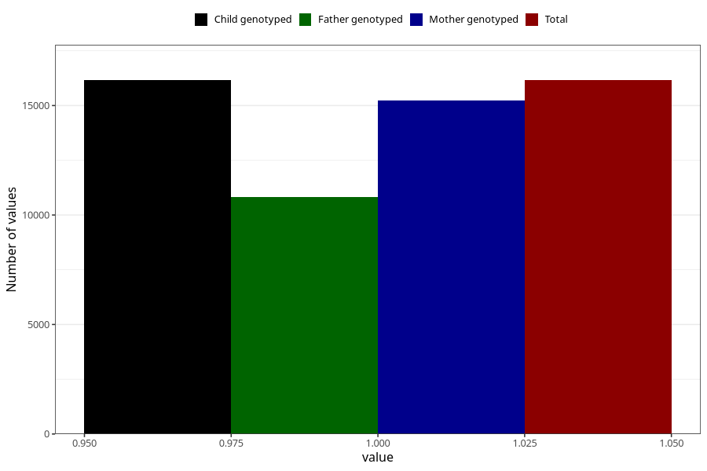

# constipation_13w_15w
Variable mapping to `AA269` in `Skjema1_v12`.
- Number of values:

| Value | Total | Child genotyped | Mother genotyped | Father genotyped |
| ----- | ----- | --------------- | ---------------- | ---------------- |
| Missing | 64850 | 64850 | 61377 | 42793 |
| Non-missing | 16155 | 16155 | 15240 | 10811 |
| 1 | 16155 | 16155 | 15240 | 10811 |

