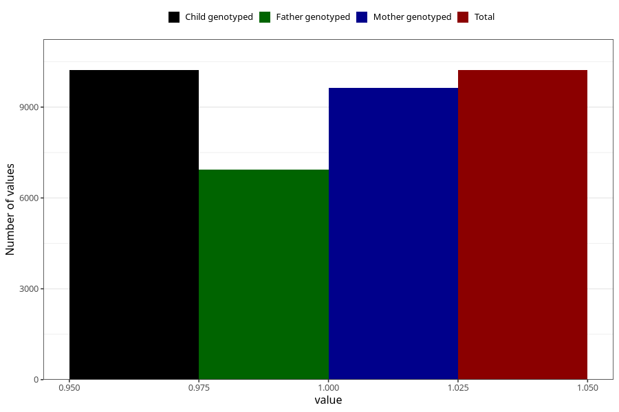

# constipation_13w_16w
Variable mapping to `CC436` in `Skjema3_v12`.
- Number of values:

| Value | Total | Child genotyped | Mother genotyped | Father genotyped |
| ----- | ----- | --------------- | ---------------- | ---------------- |
| Missing | 70785 | 70785 | 66977 | 46669 |
| Non-missing | 10220 | 10220 | 9640 | 6935 |
| 1 | 10220 | 10220 | 9640 | 6935 |

